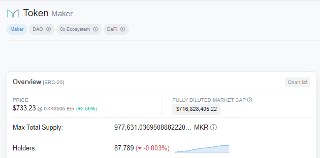

# Intro

Flipside's governance team works deeply with the MakerDAO team to create, discuss, and vote on proposals that
ultimately improve Maker's market position and revenue model. In order to increase our influence 
at Maker, we seek delegation of MKR to our voting address.

This markdown details use of the new Flipside `ethscore` package to identify potential
addresses to target to request/earn delegation of their MKR to our voting address.

# Package Requirements

ethscore uses shroomDK to access Flipside data for its analysis. The best way to install these 
packages is via devtools install_github().

```{r, eval = FALSE,  message = FALSE, warning= FALSE}
# This chunk does not eval
# library(devtools) # install if you haven't already
# devtools::install_github(repo = 'FlipsideCrypto/sdk', subdir = 'r/shroomDK')
# devtools::install_github(repo = 'FlipsideCrypto/ethscore')
```

# Addressable Market of MKR Delegation

Not all holders of an ERC20 are externally owned accounts (EOAs). Some are contract addresses,
others are gnosis-safes. Among EOAs, there are central exchange managed EOAs for coordinating deposits and withdrawals
on and off chain which would be inappropriate targets for delegation. Also some EOAs are 'cold storage' in that they hold a balance but have never initiated a transaction. If an EOA has never done a transaction, it is unlikely its first 
will be delegation of a token which requires approvals and other contract interactions that the user may find risky.

Thus, for the purposes of growing our delegation, it is imperative we understand the addressable market
as: 

    - EOAs that are active and likely human owned
    - Gnosis safes, e.g., DAO multi-sigs.
    - MKR in the delegate contract(s)
        - Note: this is 'pvp' in that each MKR we are delegated from this contract is explicitly a MKR taken from another delegate. While we support competition, our first goal is to activate more MKR, not simply fight over a fixed pool.  
    
## Current balance of MKR held by those with 1+ MKR

'Dust' is common in crypto. Users make swaps of non-integer sizes and end up with balances that use many of the 
18 decimals permitted by ERC20s, e.g., having 0.0042069 MKR (~ $3 at time of writing). This naturally inflates 
the 'holders' number we commonly see in tools like etherscan.



Of the 87,000 Holders of MKR, only 6,375 (7%) have at least 1 whole MKR (~$700 at time of writing).
Given that MKR uses on-chain voting on the Ethereum Layer 1, it may be cost prohibitive in ETH gas 
terms for smaller holders to delegate and vote on-chain (as opposed to an off-chain tool like Snapshot).

```{r, message = FALSE, warning= FALSE}
library(shroomDK)
library(ethscore)
library(dplyr)
library(reactable)
library(plotly)


mkr <- tolower("0x9f8f72aa9304c8b593d555f12ef6589cc3a579a2")
max_block <- 15440000 # August 30th 11AM UTC
api_key <- readLines("api_key.txt") # get a free key @ https://sdk.flipsidecrypto.xyz/shroomdk

mkr_balances <- address_token_balance(token_address = mkr, min_tokens = 1, 
                                      block_max = max_block, api_key = api_key)

message(
  paste0('There are ', nrow(mkr_balances), ' holders of MKR with at least 1 MKR (as of block: ', max_block, ")")
)

plot_ly(mkr_balances, x = ~ADDRESS_TYPE, y = ~log(NEW_VALUE), color = ~ADDRESS_TYPE,
        boxpoints = "all", jitter = 0.3,
        hoverinfo = 'text',
        hovertext = ~paste0(
          'Log-MKR Balance: ',
          round(log(NEW_VALUE), 2),'\n Raw MKR Balance: ', 
          scales::label_comma()(floor(NEW_VALUE))
        ),
        type = 'box') %>% 
  layout(title = '\nDistribution of MKR among those with 1+ MKR',
         xaxis = list(title = 'Address Type'),
         yaxis = list(title = 'LOG(MKR Balance)')
  )

```

Because holdings of most ERC20s is highly skewed (i.e., most addresses have very few MKR and a few have very large amounts)
a LOG scale is used to more cleanly see differences in the distribution of MKR across Address Types.

The key insights to note:

    - Non-targets like contracts, cold storage EOAs, and central exchange EOAs have a wide variance in their MKR holdings.
    - Target EOAs (Orange, hover over to see non-LOG values) have a median of 2 MKR each and a 75% percentile of ~95 MKR.
    - The top holders of MKR are contracts and central exchange EOAs.

In practical terms, of the 977,000 MKR total supply held by 87,000 holders (Etherscan above), there are only 
5,150 EOAs active and with enough MKR (1+) to be delegate targets. These EOAs hold 356,015 MKR, only 36% of supply.


```{r}
mkr_smmry <- mkr_balances %>% group_by(ADDRESS_TYPE) %>% 
  summarise(num = n(),
            total = scales::label_comma()(floor(sum(NEW_VALUE))),
            avg = scales::label_comma()(floor(mean(NEW_VALUE))), 
            median = scales::label_comma()(floor(median(NEW_VALUE))),
            max = scales::label_comma()(floor(max(NEW_VALUE))),
            sd = scales::label_comma()(floor(sd(NEW_VALUE))))

reactable(mkr_smmry,
columns = list(
  ADDRESS_TYPE = colDef(name = 'Address Type'),
  num = colDef(name = 'Count', align = 'right'),
  total = colDef(name = 'Total', align = 'right'),
  avg = colDef(name = 'Average', align = 'right'),
  median = colDef(name = 'Median', align = 'right'),
  max = colDef(name = 'Max', align = 'right'),
  sd = colDef(name = 'Standard Deviation', align = 'right')
))

```


```{r}
message(
  paste0(
    'MKR Governance Contract has ',
    scales::label_comma()(floor(mkr_balances[
      mkr_balances$ADDRESS == tolower('0x0a3f6849f78076aefaDf113F5BED87720274dDC0'), "NEW_VALUE"]
    )), 
    ' MKR'
)
)
```


The MKR governance contract: 0x0a3f6849f78076aefaDf113F5BED87720274dDC0 held 188,866 MKR as of 
block 15440000. The Largest contract and overall address holder of MKR. 

This means of the total 977,631 MKR: 544,881 (~56%) is practically available for delegation.

    - 356,015 in EOAs w/ 1+ MKR that are not in the governance contract.
    - 188,866 in the governance contract whose delegation can be fought over pvp style.
    - Note: excluding the single gnosis-safe holding 9,556 for now.
    
At time of writing, Flipside Crypto has ~9,000 MKR delegated to it (4.7% of current governance).

## Time-Weighted MKR Holders

Instead of analyzing holders based on current balance on MKR, we can add weight for *having held* MKR 
for a long time. For example, weighing an address whose held 10 MKR for 100,000 blocks as a better delegate
target than one who has held 100 MKR for only 1,000 blocks.

Giving users 1 point per MKR for every 1,000 blocks where they held at least 0.1 MKR 
in the range of Jan 1, 2021 (block #:11,566,000) to 
Aug 30th 11am UTC (block # 15,440,000) it is clear there is a strong correlation
between holding MKR now and having held it in the past- but important outliers and nuance 
allow for more precision in targeting potential delegates.

```{r,  message = FALSE, warning= FALSE}

min_block <- 11566000

mkr_timeweighted <- address_time_weighted_token_balance(mkr,
                                                        min_tokens =  0.1,
                                                        block_min = min_block, 
                                                        block_max = max_block,
                                                        amount_weighting = TRUE,
                                                        api_key = api_key 
                                                        )

plot_ly(mkr_timeweighted, x = ~ADDRESS_TYPE, y = ~log(TIME_WEIGHTED_SCORE),
        color = ~ADDRESS_TYPE,
        boxpoints = "all", jitter = 0.3,
        hoverinfo = 'text',
        hovertext = ~paste0(
          'Log-MKR TW Score: ',
          round(log(TIME_WEIGHTED_SCORE), 2),
          '\n Raw MKR TW Score: ',
          scales::label_comma()(floor(TIME_WEIGHTED_SCORE))
        ),
        type = 'box') %>% 
  layout(title = '\nDistribution of MKR Time Weighted Scoring',
         xaxis = list(title = 'Address Type'),
         yaxis = list(title = 'LOG(MKR TW Score)')
  )

# merging and imputing current balance 0 to compare tw score and balance
mkr_tw_bal <- merge(x = mkr_timeweighted[, c("ADDRESS","TIME_WEIGHTED_SCORE","ADDRESS_TYPE")],
                    y = mkr_balances[,c("ADDRESS","NEW_VALUE")],
                    all.x = TRUE, by = "ADDRESS")

mkr_tw_bal$NEW_VALUE[is.na(mkr_tw_bal$NEW_VALUE)] <- 0

plot_ly(mkr_tw_bal, x = ~log(NEW_VALUE), y = ~log(TIME_WEIGHTED_SCORE), 
        color = ~ADDRESS_TYPE, type = 'scatter',
        hoverinfo = 'text',
        hovertext = ~paste0(
          'RAW-MKR Balance: ',
          scales::label_comma()(floor(NEW_VALUE)),
          '\n Raw MKR TW Score: ',
          scales::label_comma()(floor(TIME_WEIGHTED_SCORE))
        )
) %>% 
  layout(title = '\n Current MKR Balance vs Time-Weighted Score',
         xaxis = list(title = 'LOG(Current MKR Balance)'),
         yaxis = list(title = 'LOG(MKR TW Score)')
  )


```

